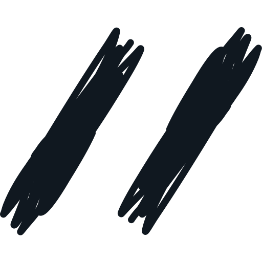
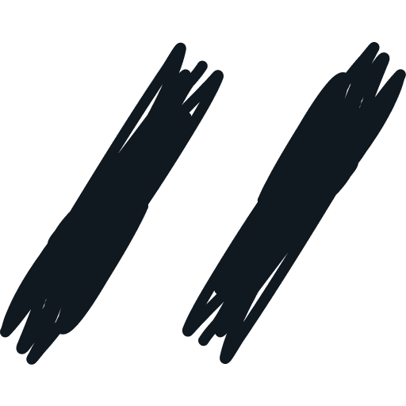

## Images in txt color (#101820)

* https://raw.githubusercontent.com/i11n/.github/main/profile/img/txt/

### avatar.svg

### banner.svg

### logo-etched.svg

### logo-open-source.svg

### logo-scribbled.svg

### logotype-name.svg

### logotype-tag.svg

### Favicons 

* https://raw.githubusercontent.com/i11n/.github/main/profile/img/txt/favicon/

#### android-chrome-192x192.png

#### android-chrome-512x512.png

#### apple-touch-icon.png

#### favicon-16x16.png

#### favicon-32x32.png

